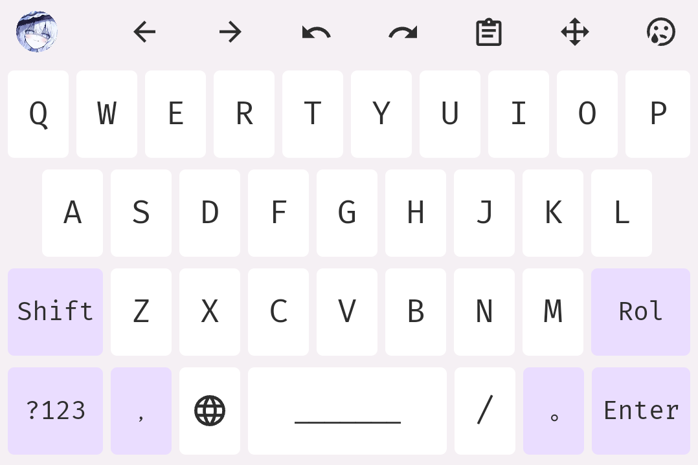
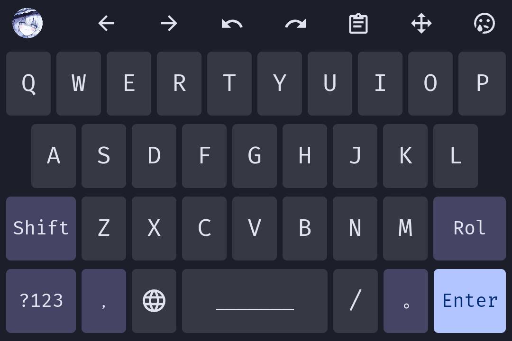

# Hanamru Theme for Trime

使用 nickel 编写的 Trime 主题配置。

## 预览图

| Light | Dark |
|-------|-------|
|  |  |

## 主题变体

| 文件 | 说明 |
|------|------|
| hanamaru | 主体主题 |
| hanamaru27 | 27键布局 |
| hanamaru30 | 30键布局 |
| hanamaru30_column | 30键矩阵布局 |

## 待办

- [ ] 重新设计数字键盘
